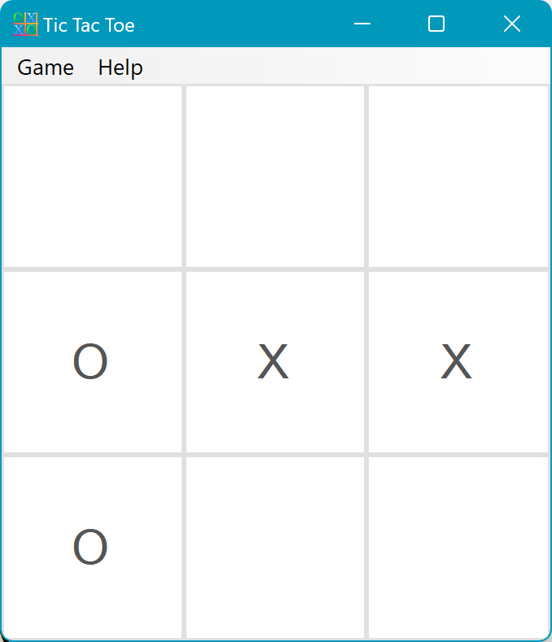
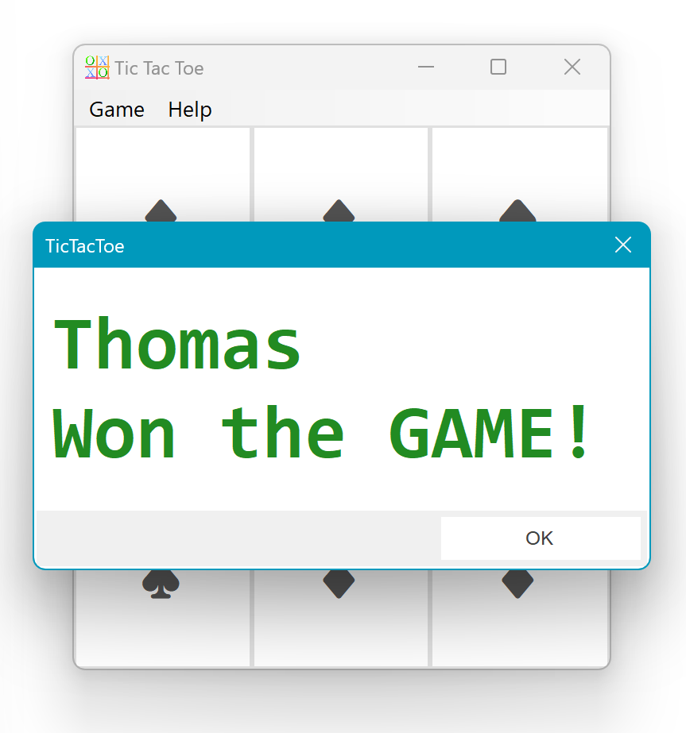
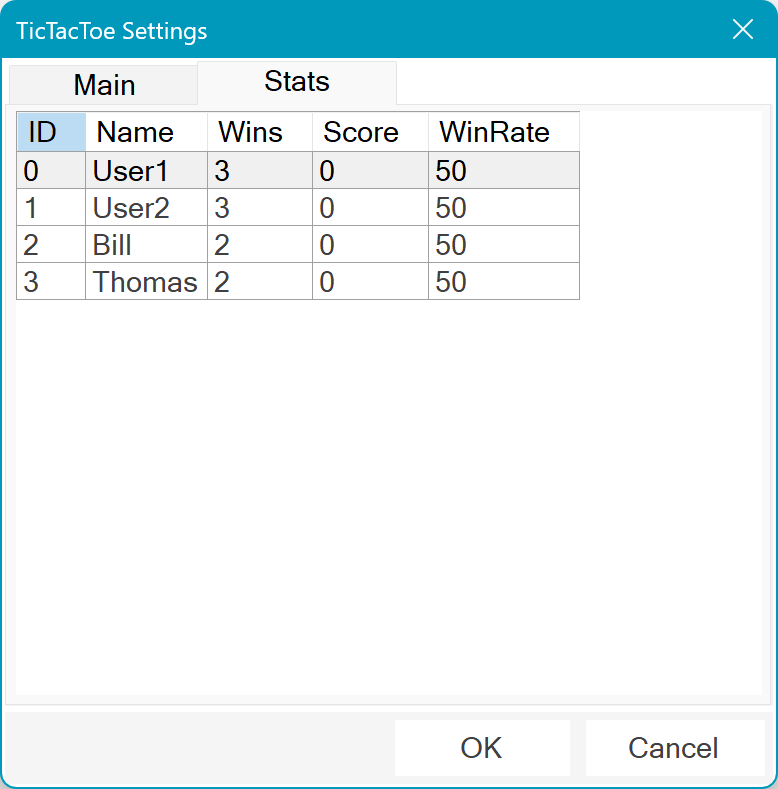
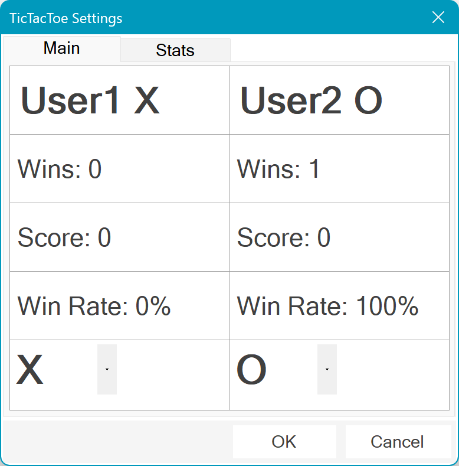
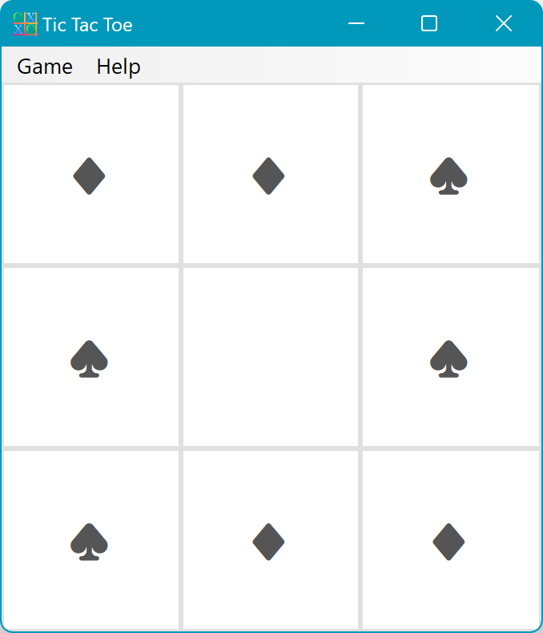

# Tic Tac Toe DOT

**y: 2021**

Tic-Tac-Toe: A Classic Game for All Ages

Tic-Tac-Toe is a simple yet addictive game that has been enjoyed by people of all ages for centuries. It's a great way to pass the time, challenge your friends and family, and hone your strategic thinking skills.

This tic tac toe game is *enriched* with settings such as changing X's and O's and each player's name showing and saving their scorer. The graphic interface reflects harmony and abstraction with colors pleasing to the eye.

<h2>Simple Light theme </h2> 

<h2> Who is the WINNER?? </h2> 

<h2> Look who wins from the whole team </h2>

<h2> Enter your name, see your score and play </h2>

<h2> Change X and O to whatever you want </h2>

## Download and compile

The application was developed with Microsoft Visual Studio Community 2022 .net frameworks 4.7.2

## MIT License

**Copyright (c) 2023 Bill Chamalidis**
